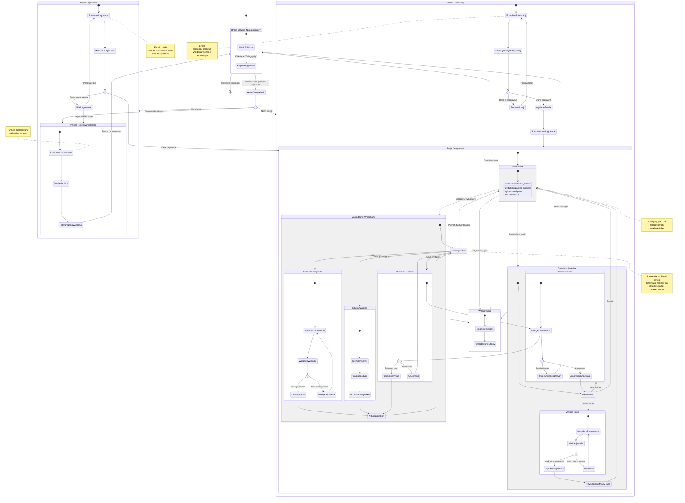

# Diagram Podróży Użytkownika - CashBuddy

## Przegląd
Diagram przedstawia kompleksową podróż użytkownika przez aplikację CashBuddy, od momentu pierwszej wizyty jako niezalogowany użytkownik, przez proces autentykacji, aż po korzystanie z głównych funkcjonalności aplikacji.

## Główne Ścieżki Użytkownika

### 1. Niezalogowany Użytkownik
- Dostęp do strony głównej
- Możliwość rozpoczęcia procesu logowania/rejestracji
- Dostęp do funkcji resetowania hasła

### 2. Proces Autentykacji
- **Logowanie**: Weryfikacja danych, przekierowanie do dashboardu
- **Rejestracja**: Walidacja, wysłanie e-maila, automatyczne zalogowanie
- **Reset hasła**: Proces odzyskiwania dostępu (zaplanowany)

### 3. Zalogowany Użytkownik
- **Dashboard**: Przegląd statystyk i wydatków
- **Zarządzanie wydatkami**: Dodawanie, edycja, usuwanie
- **Panel użytkownika**: Zmiana hasła, usunięcie konta
- **Wylogowanie**: Bezpieczne zakończenie sesji

## Diagram

## Kluczowe Punkty Decyzyjne

1. **Wybór typu autentykacji**: Użytkownik decyduje czy chce się zalogować, zarejestrować czy odzyskać hasło
2. **Walidacja logowania**: System sprawdza poprawność danych dostępowych
3. **Walidacja rejestracji**: Weryfikacja zgodności danych z wymaganiami (e-mail, hasło ≥8 znaków)
4. **Operacje na wydatkach**: Decyzje dotyczące dodawania, edycji lub usuwania wydatków
5. **Potwierdzenie usunięcia**: Weryfikacja intencji użytkownika przy krytycznych operacjach
6. **Zmiana hasła**: Walidacja nowego hasła zgodnie z wymaganiami bezpieczeństwa
7. **Usunięcie konta**: Finalne potwierdzenie nieodwracalnej operacji

## Zgodność z Historiami Użytkownika

Diagram pokrywa wszystkie kluczowe historie użytkownika z PRD:
- **US-001**: Proces rejestracji z walidacją i wysyłką e-maila
- **US-002**: Proces logowania z obsługą błędów i linkiem do resetowania hasła
- **US-003**: Proces wylogowania z bezpiecznym zakończeniem sesji
- **US-004-006**: Pełne zarządzanie wydatkami (dodawanie, edycja, usuwanie)
- **US-007**: Lista wydatków z filtrowaniem i sortowaniem
- **US-008-011**: Dashboard ze statystykami
- **US-012**: Zmiana hasła w panelu użytkownika
- **US-013**: Usunięcie konta z potwierdzeniem

## Notatki Techniczne

- Wszystkie przejścia między stanami zachodzą bez przeładowania strony (SPA)
- Walidacja odbywa się w czasie rzeczywistym
- Komunikaty błędów są jasne i nie ujawniają szczegółów bezpieczeństwa
- Dane użytkownika są izolowane zgodnie z RODO
- Responsywność zapewniona na wszystkich ekranach ≥320px

