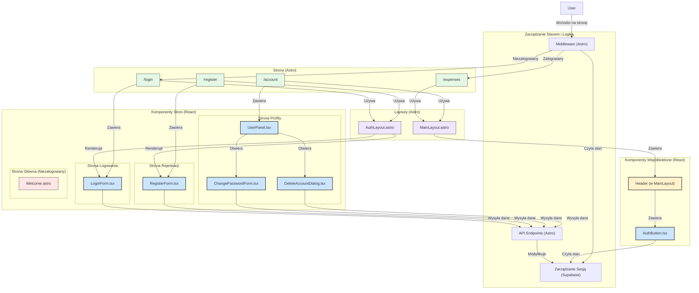

<architecture_analysis>
Na podstawie analizy pliku `prd.md`, zidentyfikowałem kluczowe elementy architektury UI dla modułu uwierzytelniania i zarządzania kontem w aplikacji CashBuddy. Poniżej znajduje się szczegółowy opis komponentów, stron i przepływu danych.

### 1. Komponenty

- **`MainLayout.astro`**: Główny layout aplikacji, który zarządza wyświetlaniem treści chronionych oraz publicznych. Będzie zawierał komponent `AuthButton`.
- **`AuthLayout.astro`**: Specjalny layout dla stron logowania i rejestracji, posiadający uproszczoną strukturę bez elementów nawigacyjnych dla zalogowanych użytkowników.
- **`LoginForm.tsx`**: Formularz logowania z polami na e-mail i hasło. Odpowiedzialny za walidację danych i komunikację z API w celu uwierzytelnienia użytkownika.
- **`RegisterForm.tsx`**: Formularz rejestracji, zbierający e-mail i hasło. Podobnie jak `LoginForm`, waliduje dane i wysyła je do API.
- **`UserPanel.tsx`**: Komponent na stronie profilu użytkownika, który umożliwia dostęp do formularza zmiany hasła i opcji usunięcia konta.
- **`ChangePasswordForm.tsx`**: Formularz do zmiany hasła, wymagający podania starego i nowego hasła.
- **`DeleteAccountDialog.tsx`**: Dialog potwierdzający usunięcie konta, aby zapobiec przypadkowemu usunięciu danych.
- **`AuthButton.tsx`**: Komponent w nagłówku, który dynamicznie wyświetla przycisk "Zaloguj" dla gości lub "Wyloguj" i awatar dla zalogowanych użytkowników.
- **`Welcome.astro`**: Komponent powitalny, który jest widoczny dla niezalogowanych użytkowników.

### 2. Strony

- **`/` (Strona Główna)**: Przekierowuje do `/login`, jeśli użytkownik nie jest zalogowany, lub do `/expenses`, jeśli jest zalogowany.
- **`/login`**: Strona logowania, wykorzystująca `AuthLayout.astro` i zawierająca komponent `LoginForm.tsx`.
- **`/register`**: Strona rejestracji, oparta na `AuthLayout.astro` z komponentem `RegisterForm.tsx`.
- **`/expenses`**: Główna strona aplikacji z listą wydatków, dostępna tylko dla zalogowanych użytkowników. Korzysta z `MainLayout.astro`.
- **`/account`**: Strona profilu użytkownika, gdzie znajduje się `UserPanel.tsx`, dostępna tylko po zalogowaniu.

### 3. Przepływ Danych

1.  Użytkownik wchodzi na stronę główną. Middleware sprawdza stan sesji.
2.  Jeśli użytkownik nie jest zalogowany, zostaje przekierowany na stronę `/login`.
3.  Na stronie `/login` komponent `LoginForm.tsx` wysyła dane do API. Po pomyślnym zalogowaniu, sesja jest tworzona, a użytkownik jest przekierowywany na stronę `/expenses`.
4.  Podobnie działa proces rejestracji na stronie `/register` z użyciem `RegisterForm.tsx`.
5.  Zalogowany użytkownik widzi w nagłówku przycisk "Wyloguj" (`AuthButton.tsx`), który po kliknięciu kończy sesję i przekierowuje na `/login`.
6.  Na stronie `/account` komponent `UserPanel.tsx` zarządza stanem formularzy zmiany hasła i dialogu usunięcia konta.

### 4. Aktualizacje

- **Nowe komponenty**: `LoginForm`, `RegisterForm`, `UserPanel`, `ChangePasswordForm`, `DeleteAccountDialog`, `AuthButton`.
- **Nowe strony**: `/login`, `/register`, `/account`.
- **Nowe layouty**: `AuthLayout`.
- **Zmiany w istniejącej strukturze**: `MainLayout` zostanie zaktualizowany o logikę sesji i komponent `AuthButton`. Middleware będzie zarządzać routingiem w zależności od stanu uwierzytelnienia.
</architecture_analysis>
<mermaid_diagram>

</mermaid_diagram>
